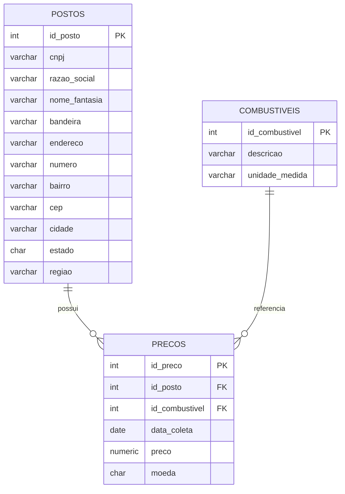

```mermaid
erDiagram
    POSTOS {
        int id_posto PK
        varchar cnpj
        varchar razao_social
        varchar nome_fantasia
        varchar bandeira
        varchar endereco
        varchar numero
        varchar bairro
        varchar cep
        varchar cidade
        char estado
        varchar regiao
    }

    COMBUSTIVEIS {
        int id_combustivel PK
        varchar descricao
        varchar unidade_medida
    }

    PRECOS {
        int id_preco PK
        int id_posto FK
        int id_combustivel FK
        date data_coleta
        numeric preco
        char moeda
    }

    POSTOS ||--o{ PRECOS : possui
    COMBUSTIVEIS ||--o{ PRECOS : referencia
```
